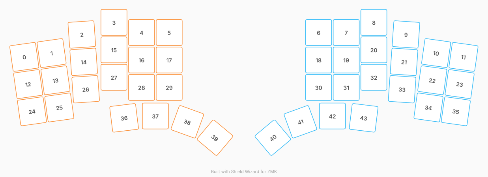

# ZMK Configuration for splake_ish-test

*Generated by Shield Wizard for ZMK*



Download compiled firmware from the Actions tab. <https://zmk.dev/docs/user-setup#installing-the-firmware>

Edit your keymap <https://zmk.dev/docs/keymaps>.
User keymap is located at [`config/splake_ish_test.keymap`](config/splake_ish_test.keymap).

-----

<details>
<summary>
Shield Wizard Debug Information
</summary>

In case of broken configuration, here is the Shield Wizard internal data used to generate this configuration:

Commit: 84a348b08cf4fec4a5441a46147e9a345b10ffab

```json
{"name":"splake_ish-test","shield":"splake_ish_test","dongle":false,"modules":[],"layout":[{"id":"01M42XDBGTGF3N6HXPD9S2FDXS","part":0,"row":0,"col":0,"w":1,"h":1,"x":0.065,"y":1.256,"r":-8,"rx":0.565,"ry":1.756},{"id":"01M42XDBGT822TSX7HKZTCXD86","part":0,"row":0,"col":1,"w":1,"h":1,"x":1.055,"y":1.117,"r":-8,"rx":1.555,"ry":1.617},{"id":"01M42XDBGTCQNQ00FR4N9NX51F","part":0,"row":0,"col":2,"w":1,"h":1,"x":2.148,"y":0.44,"r":-4,"rx":2.648,"ry":0.94},{"id":"01M42XDBGTC2840KSNWVZ7DE7J","part":0,"row":0,"col":3,"w":1,"h":1,"x":3.312,"y":0,"r":0,"rx":0,"ry":0},{"id":"01M42XDBGTC025F5PDE6Q2TZF0","part":0,"row":0,"col":4,"w":1,"h":1,"x":4.312,"y":0.368,"r":0,"rx":0,"ry":0},{"id":"01M42XDBGTYQVAPH95T72GN2FA","part":0,"row":0,"col":5,"w":1,"h":1,"x":5.312,"y":0.368,"r":0,"rx":0,"ry":0},{"id":"01M42XDBGT0VTGJQDVGCJ385Y8","part":1,"row":0,"col":8,"w":1,"h":1,"x":10.723,"y":0.368,"r":0,"rx":0,"ry":0},{"id":"01M42XDBGT84C7B8PWN1BAX21S","part":1,"row":0,"col":9,"w":1,"h":1,"x":11.723,"y":0.368,"r":0,"rx":0,"ry":0},{"id":"01M42XDBGTJM9CGYKC9BHB58Z6","part":1,"row":0,"col":10,"w":1,"h":1,"x":12.723,"y":0,"r":0,"rx":0,"ry":0},{"id":"01M42XDBGT3ZXH9VX6DM7YJ4WJ","part":1,"row":0,"col":11,"w":1,"h":1,"x":13.887,"y":0.44,"r":4,"rx":14.387,"ry":0.94},{"id":"01M42XDBGTFR402D720TZW81T3","part":1,"row":0,"col":12,"w":1,"h":1,"x":14.979,"y":1.117,"r":8,"rx":15.479,"ry":1.617},{"id":"01M42XDBGT3AG8VE8J5DMEJFDP","part":1,"row":0,"col":13,"w":1,"h":1,"x":15.97,"y":1.256,"r":8,"rx":16.47,"ry":1.756},{"id":"01M42XDBGTYTCRQHQRK24T5SK9","part":0,"row":1,"col":0,"w":1,"h":1,"x":0.204,"y":2.247,"r":-8,"rx":0.704,"ry":2.747},{"id":"01M42XDBGT6MW8TJBAG0YPBD5T","part":0,"row":1,"col":1,"w":1,"h":1,"x":1.194,"y":2.107,"r":-8,"rx":1.694,"ry":2.607},{"id":"01M42XDBGTFXBJMWG1NJJXG3YT","part":0,"row":1,"col":2,"w":1,"h":1,"x":2.217,"y":1.437,"r":-4,"rx":2.717,"ry":1.937},{"id":"01M42XDBGTF81AFVGYXRPM3DXM","part":0,"row":1,"col":3,"w":1,"h":1,"x":3.312,"y":1,"r":0,"rx":0,"ry":0},{"id":"01M42XDBGTPYQEXMQZQEWAYKE1","part":0,"row":1,"col":4,"w":1,"h":1,"x":4.312,"y":1.368,"r":0,"rx":0,"ry":0},{"id":"01M42XDBGTFPFQQDD93AQAR3Y3","part":0,"row":1,"col":5,"w":1,"h":1,"x":5.312,"y":1.368,"r":0,"rx":0,"ry":0},{"id":"01M42XDBGT59R7GJGZ6TBSEC56","part":1,"row":1,"col":8,"w":1,"h":1,"x":10.723,"y":1.368,"r":0,"rx":0,"ry":0},{"id":"01M42XDBGTJ7SGDCKVWMRFB9NZ","part":1,"row":1,"col":9,"w":1,"h":1,"x":11.723,"y":1.368,"r":0,"rx":0,"ry":0},{"id":"01M42XDBGT2K2YRA8G1FE6RQX5","part":1,"row":1,"col":10,"w":1,"h":1,"x":12.723,"y":1,"r":0,"rx":0,"ry":0},{"id":"01M42XDBGTM8T8YEG1MSJ0REKP","part":1,"row":1,"col":11,"w":1,"h":1,"x":13.817,"y":1.437,"r":4,"rx":14.317,"ry":1.937},{"id":"01M42XDBGTAZAFQVFEMN3QVY2F","part":1,"row":1,"col":12,"w":1,"h":1,"x":14.84,"y":2.107,"r":8,"rx":15.34,"ry":2.607},{"id":"01M42XDBGTG51FA6AN39KEYE0X","part":1,"row":1,"col":13,"w":1,"h":1,"x":15.83,"y":2.247,"r":8,"rx":16.33,"ry":2.747},{"id":"01M42XDBGT8ENBSKW5CF6KQR38","part":0,"row":2,"col":0,"w":1,"h":1,"x":0.343,"y":3.237,"r":-8,"rx":0.843,"ry":3.737},{"id":"01M42XDBGTGQMYV2MM28J9FC49","part":0,"row":2,"col":1,"w":1,"h":1,"x":1.333,"y":3.098,"r":-8,"rx":1.833,"ry":3.598},{"id":"01M42XDBGTX585MQ64ZG2PP49J","part":0,"row":2,"col":2,"w":1,"h":1,"x":2.287,"y":2.435,"r":-4,"rx":2.787,"ry":2.935},{"id":"01M42XDBGTTXYB65HY43BBCSW8","part":0,"row":2,"col":3,"w":1,"h":1,"x":3.312,"y":2,"r":0,"rx":0,"ry":0},{"id":"01M42XDBGTQSE6A6CC2RSZ6BWQ","part":0,"row":2,"col":4,"w":1,"h":1,"x":4.312,"y":2.368,"r":0,"rx":0,"ry":0},{"id":"01M42XDBGTA8K4TSNTR4WXQGAZ","part":0,"row":2,"col":5,"w":1,"h":1,"x":5.312,"y":2.368,"r":0,"rx":0,"ry":0},{"id":"01M42XDBGTPE8S6BK6VES5GXDZ","part":1,"row":2,"col":8,"w":1,"h":1,"x":10.723,"y":2.368,"r":0,"rx":0,"ry":0},{"id":"01M42XDBGT0RCQ5VY1NSD1SFCY","part":1,"row":2,"col":9,"w":1,"h":1,"x":11.723,"y":2.368,"r":0,"rx":0,"ry":0},{"id":"01M42XDBGTQV21Y0MY8BKZSAY5","part":1,"row":2,"col":10,"w":1,"h":1,"x":12.723,"y":2,"r":0,"rx":0,"ry":0},{"id":"01M42XDBGT89PP62FNXGZTJ3HH","part":1,"row":2,"col":11,"w":1,"h":1,"x":13.747,"y":2.435,"r":4,"rx":14.247,"ry":2.935},{"id":"01M42XDBGTTSXNVKE5CXGH986Y","part":1,"row":2,"col":12,"w":1,"h":1,"x":14.701,"y":3.098,"r":8,"rx":15.201,"ry":3.598},{"id":"01M42XDBGTWCKC2YY6WCTZ43YM","part":1,"row":2,"col":13,"w":1,"h":1,"x":15.691,"y":3.237,"r":8,"rx":16.191,"ry":3.737},{"id":"01M42XDBGT6S5G84V7V2Q9GCYZ","part":0,"row":3,"col":3,"w":1,"h":1,"x":3.68,"y":3.476,"r":-7,"rx":4.18,"ry":3.976},{"id":"01M42XDBGT01PSDM2MKZTC9364","part":0,"row":3,"col":4,"w":1,"h":1,"x":4.812,"y":3.408,"r":0,"rx":0,"ry":0},{"id":"01M42XDBGT4WK7T7YCQCZ8WFBF","part":0,"row":3,"col":5,"w":1,"h":1,"x":5.97,"y":3.619,"r":20,"rx":6.47,"ry":4.119},{"id":"01M42XDBGTY7T2XHTQ67PERSB0","part":0,"row":3,"col":6,"w":1,"h":1,"x":6.97,"y":4.198,"r":40,"rx":7.47,"ry":4.698},{"id":"01M42XDBGT58TDNJRJNK6N4NTY","part":1,"row":3,"col":7,"w":1,"h":1,"x":9.065,"y":4.198,"r":-40,"rx":9.565,"ry":4.698},{"id":"01M42XDBGTNVXJGKABV6X6BNAZ","part":1,"row":3,"col":8,"w":1,"h":1,"x":10.065,"y":3.619,"r":-20,"rx":10.565,"ry":4.119},{"id":"01M42XDBGTBKFHNKBP0WJ77C8P","part":1,"row":3,"col":9,"w":1,"h":1,"x":11.223,"y":3.408,"r":0,"rx":0,"ry":0},{"id":"01M42XDBGTR1YDPV9ZT9YWTNFK","part":1,"row":3,"col":10,"w":1,"h":1,"x":12.354,"y":3.476,"r":7,"rx":12.854,"ry":3.976}],"parts":[{"name":"left","controller":"nice_nano_v2","pins":{"d2":{"usage":"kscan","kscan":"01M42XF62RNT9KY7HQ16PZ38A4","role":"output"},"d3":{"usage":"kscan","kscan":"01M42XF62RNT9KY7HQ16PZ38A4","role":"output"},"d4":{"usage":"kscan","kscan":"01M42XF62RNT9KY7HQ16PZ38A4","role":"output"},"d5":{"usage":"kscan","kscan":"01M42XF62RNT9KY7HQ16PZ38A4","role":"output"},"d6":{"usage":"kscan","kscan":"01M42XF62RNT9KY7HQ16PZ38A4","role":"output"},"d7":{"usage":"kscan","kscan":"01M42XF62RNT9KY7HQ16PZ38A4","role":"output"},"d9":{"usage":"kscan","kscan":"01M42XF62RNT9KY7HQ16PZ38A4","role":"input"},"d10":{"usage":"kscan","kscan":"01M42XF62RNT9KY7HQ16PZ38A4","role":"input"},"d16":{"usage":"kscan","kscan":"01M42XF62RNT9KY7HQ16PZ38A4","role":"input"},"d14":{"usage":"kscan","kscan":"01M42XF62RNT9KY7HQ16PZ38A4","role":"input"}},"kscans":[{"kind":"matrix","id":"01M42XF62RNT9KY7HQ16PZ38A4","diodes":true}],"keys":{"01M42XDBGT8ENBSKW5CF6KQR38":{"input":"d9","output":"d2"},"01M42XDBGTYTCRQHQRK24T5SK9":{"input":"d10","output":"d2"},"01M42XDBGTGF3N6HXPD9S2FDXS":{"input":"d14","output":"d2"},"01M42XDBGTGQMYV2MM28J9FC49":{"input":"d9","output":"d3"},"01M42XDBGT6MW8TJBAG0YPBD5T":{"input":"d10","output":"d3"},"01M42XDBGT822TSX7HKZTCXD86":{"input":"d14","output":"d3"},"01M42XDBGTX585MQ64ZG2PP49J":{"input":"d9","output":"d4"},"01M42XDBGTFXBJMWG1NJJXG3YT":{"input":"d10","output":"d4"},"01M42XDBGTCQNQ00FR4N9NX51F":{"input":"d14","output":"d4"},"01M42XDBGT6S5G84V7V2Q9GCYZ":{"input":"d16","output":"d4"},"01M42XDBGT01PSDM2MKZTC9364":{"input":"d16","output":"d5"},"01M42XDBGTTXYB65HY43BBCSW8":{"input":"d9","output":"d5"},"01M42XDBGTF81AFVGYXRPM3DXM":{"input":"d10","output":"d5"},"01M42XDBGTC2840KSNWVZ7DE7J":{"input":"d14","output":"d5"},"01M42XDBGT4WK7T7YCQCZ8WFBF":{"input":"d16","output":"d6"},"01M42XDBGTQSE6A6CC2RSZ6BWQ":{"input":"d9","output":"d6"},"01M42XDBGTPYQEXMQZQEWAYKE1":{"input":"d10","output":"d6"},"01M42XDBGTC025F5PDE6Q2TZF0":{"input":"d14","output":"d6"},"01M42XDBGTY7T2XHTQ67PERSB0":{"input":"d16","output":"d7"},"01M42XDBGTA8K4TSNTR4WXQGAZ":{"input":"d9","output":"d7"},"01M42XDBGTFPFQQDD93AQAR3Y3":{"input":"d10","output":"d7"},"01M42XDBGTYQVAPH95T72GN2FA":{"input":"d14","output":"d7"}},"encoders":[],"buses":{}},{"name":"right","controller":"nice_nano_v2","pins":{"d2":{"usage":"kscan","kscan":"01M42XNV44DBAYTP78X6G30AZT","role":"output"},"d3":{"usage":"kscan","kscan":"01M42XNV44DBAYTP78X6G30AZT","role":"output"},"d4":{"usage":"kscan","kscan":"01M42XNV44DBAYTP78X6G30AZT","role":"output"},"d5":{"usage":"kscan","kscan":"01M42XNV44DBAYTP78X6G30AZT","role":"output"},"d6":{"usage":"kscan","kscan":"01M42XNV44DBAYTP78X6G30AZT","role":"output"},"d7":{"usage":"kscan","kscan":"01M42XNV44DBAYTP78X6G30AZT","role":"output"},"d9":{"usage":"kscan","kscan":"01M42XNV44DBAYTP78X6G30AZT","role":"input"},"d10":{"usage":"kscan","kscan":"01M42XNV44DBAYTP78X6G30AZT","role":"input"},"d14":{"usage":"kscan","kscan":"01M42XNV44DBAYTP78X6G30AZT","role":"input"},"d16":{"usage":"kscan","kscan":"01M42XNV44DBAYTP78X6G30AZT","role":"input"}},"kscans":[{"kind":"matrix","id":"01M42XNV44DBAYTP78X6G30AZT","diodes":true}],"keys":{"01M42XDBGT3AG8VE8J5DMEJFDP":{"input":"d14","output":"d2"},"01M42XDBGTG51FA6AN39KEYE0X":{"input":"d10","output":"d2"},"01M42XDBGTWCKC2YY6WCTZ43YM":{"input":"d9","output":"d2"},"01M42XDBGTTSXNVKE5CXGH986Y":{"input":"d9","output":"d3"},"01M42XDBGTFR402D720TZW81T3":{"input":"d14","output":"d3"},"01M42XDBGTAZAFQVFEMN3QVY2F":{"input":"d10","output":"d3"},"01M42XDBGT3ZXH9VX6DM7YJ4WJ":{"input":"d14","output":"d4"},"01M42XDBGTM8T8YEG1MSJ0REKP":{"input":"d10","output":"d4"},"01M42XDBGT89PP62FNXGZTJ3HH":{"input":"d9","output":"d4"},"01M42XDBGTR1YDPV9ZT9YWTNFK":{"input":"d16","output":"d4"},"01M42XDBGTJM9CGYKC9BHB58Z6":{"input":"d14","output":"d5"},"01M42XDBGT2K2YRA8G1FE6RQX5":{"input":"d10","output":"d5"},"01M42XDBGTQV21Y0MY8BKZSAY5":{"input":"d9","output":"d5"},"01M42XDBGTBKFHNKBP0WJ77C8P":{"input":"d16","output":"d5"},"01M42XDBGT84C7B8PWN1BAX21S":{"input":"d14","output":"d6"},"01M42XDBGTJ7SGDCKVWMRFB9NZ":{"input":"d10","output":"d6"},"01M42XDBGT0RCQ5VY1NSD1SFCY":{"input":"d9","output":"d6"},"01M42XDBGTNVXJGKABV6X6BNAZ":{"input":"d16","output":"d6"},"01M42XDBGT0VTGJQDVGCJ385Y8":{"input":"d14","output":"d7"},"01M42XDBGT59R7GJGZ6TBSEC56":{"input":"d10","output":"d7"},"01M42XDBGTPE8S6BK6VES5GXDZ":{"input":"d9","output":"d7"},"01M42XDBGT58TDNJRJNK6N4NTY":{"input":"d16","output":"d7"}},"encoders":[],"buses":{}}]}
```

</details>
